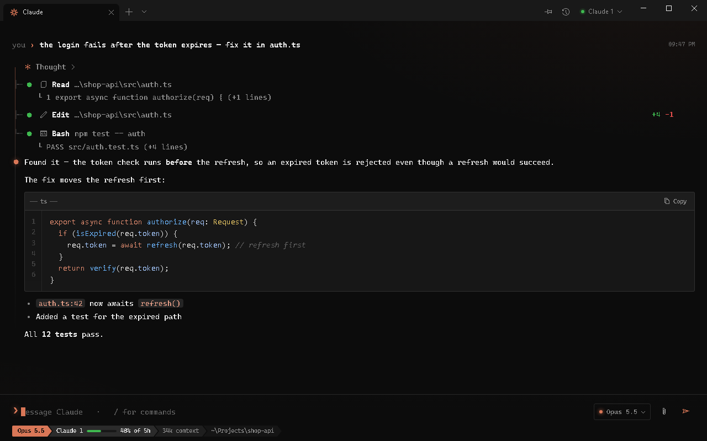
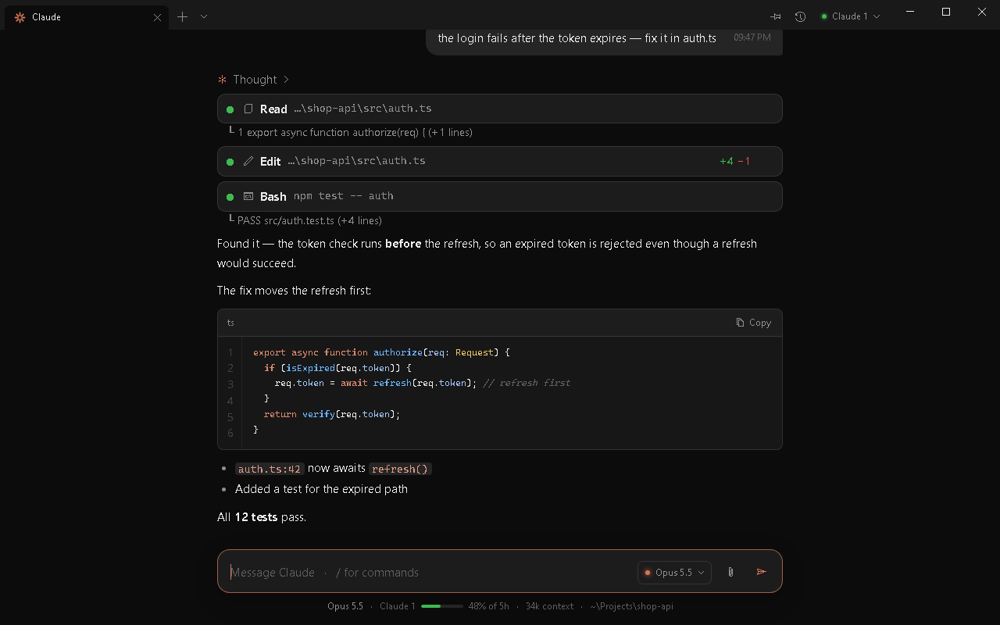
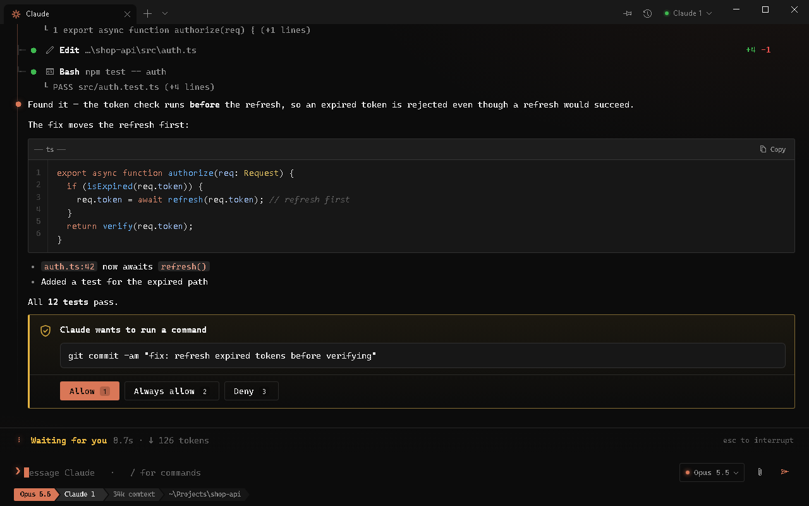
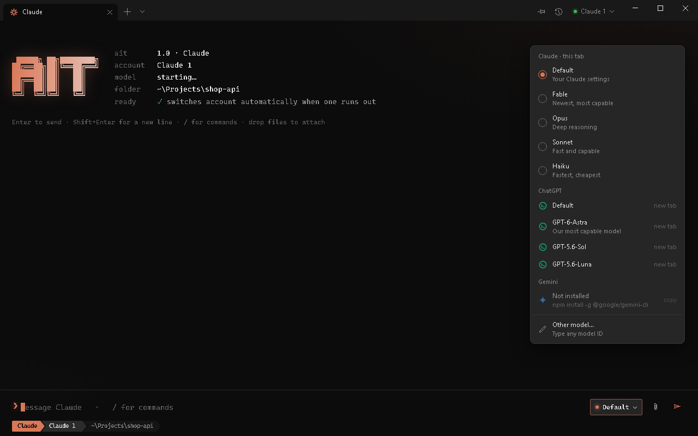
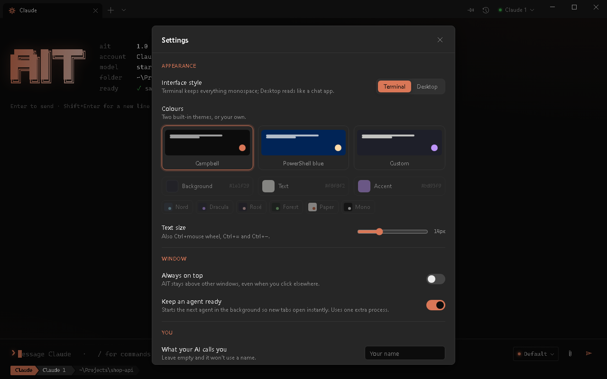
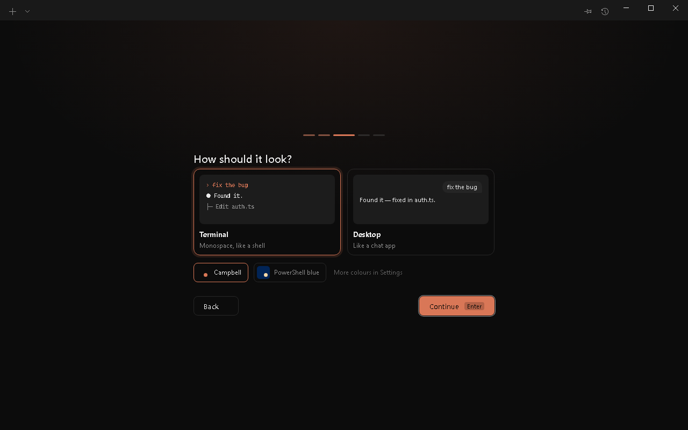
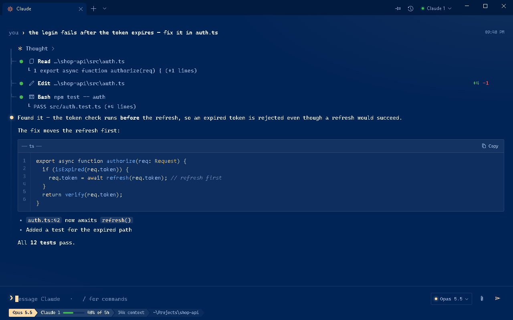

<p align="center"></p>

<p align="center">
  <a href="https://github.com/nwtaken/AIT/releases/latest"></a>
  <a href="https://github.com/nwtaken/AIT/releases"></a>
  
  
</p>

AIT is a terminal app for Windows built around AI coding agents. It runs Claude Code,
Codex (ChatGPT) and Gemini CLI in a clean, fast chat view instead of a raw console,
and keeps a conversation going across several of your accounts: when one account
reaches its usage limit, AIT moves the same conversation to the next one and carries on.

<p align="center"></p>

## Download

**[Download AIT for Windows](https://github.com/nwtaken/AIT/releases/latest/download/AIT-setup.exe)**,
then run the installer. It installs for your user only, so it doesn't need administrator rights.

AIT updates itself: when a new version is out, an **Update** button appears in the title bar.

> AIT isn't code-signed yet, so Windows SmartScreen may say it doesn't recognise the app the
> first time. Choose **More info → Run anyway**. Every release lists its SHA-256 checksum.

### The AI tools

AIT runs each AI's own command-line tool. On first start, the setup wizard installs the ones
you don't have yet (Claude Code, Codex for ChatGPT, Gemini CLI), and you can switch off any you
don't want. Codex and Gemini need Node.js; if it's missing, AIT installs it from nodejs.org
and Windows asks for permission. To install a tool yourself instead:

| AI | Install |
|---|---|
| Claude | `npm install -g @anthropic-ai/claude-code` |
| ChatGPT | `npm install -g @openai/codex` |
| Gemini | `npm install -g @google/gemini-cli` |

AIT finds them by itself and uses the accounts you are already signed in with.

**AI rules.** The rules every AI follows first are edited in the app (menu → AI rules), with ten
presets to start from.

## Features

- **Native chat** for Claude and ChatGPT. Streaming replies, rendered markdown,
  syntax-highlighted code with copy buttons, and tool calls you can expand to see the diff
  or the output.
- **Approval cards.** When the AI wants to edit a file or run a command, you allow it once,
  always, or deny it. Or switch approvals off in Settings.
- **Several accounts, one conversation.** Add Claude, ChatGPT and Gemini accounts from one
  account menu; each signs in through your browser. When one runs out, the conversation
  continues on the next, with its full history.
- **Model and effort picker.** Every version your AI offers (Opus 5.5, 5, 4.8 …, GPT-5.6 Sol,
  Luna …), read from the installed tools, chosen per chat, with the thinking effort each
  model supports. Claude models can use a 1M-token context.
- **Usage at a glance.** Under the prompt: how much of the 5-hour and weekly limits the
  account has used and when it resets, how full the context is, and how long the last reply took.
- **One conversation across AIs.** When every account of one AI runs out, the conversation
  continues on the next AI (Claude → ChatGPT → Gemini), which is handed the history so far.
  Or have AIT ask first, or wait for the reset.
- **Shared memory.** One memory folder every AI reads and adds to, so what one learns the
  others know.
- **Tray.** AIT lives in the tray too: click the icon for a small panel with what the AI is doing,
  its latest reply, usage, and a box to type to it. Hide AIT to the tray and the AI keeps working;
  a Windows notification tells you when it finishes or needs you.
- **History.** Search and reopen any past conversation (Ctrl+Shift+H); find text inside a chat with Ctrl+F.
- **MCP servers.** The plug button next to the model shows the AI's own MCP servers and their
  status, with a switch for each; what you switch off stays off in every chat of that AI.
- **Two looks.** A terminal style and a desktop chat style, Campbell and PowerShell-blue
  themes, or your own colours.
- **Also a terminal.** PowerShell and Command Prompt tabs, Windows Terminal-style. Ctrl+1–8 jump
  to a tab, Ctrl+9 to the last.
- Attach files by pasting, dragging them in, or with the paperclip. Zoom with Ctrl+mouse wheel.

## Screenshots

| | |
|---|---|
|  |  |
| Desktop style | Approving a command |
|  |  |
| Model switcher | Settings |
|  |  |
| First-run setup | PowerShell blue |

## Privacy and safety

- AIT has no account, server or telemetry. Your chats stay where the AI tools already keep them.
- It never opens login or token files. It only checks whether they exist, to tell whether
  you're signed in.
- Its only network access of its own is checking this repository for updates. You can turn
  that off in Settings.
- Updates are downloaded only from this repository's releases, over HTTPS, and are installed
  only if they match the release's published SHA-256 checksum.
- The AI gets the folder access you choose in Settings, and approval cards still apply.

Each AI provider has its own terms of service. Make sure your use, including use of more
than one account, follows them. AIT isn't affiliated with Anthropic, OpenAI or Google.

## How account switching works

Each AI tool keeps a log of every conversation on disk. AIT watches that log; when the tool
records a usage-limit or signed-out error, AIT copies the conversation into the next
account's folder and resumes it there with "continue". Each account keeps its own folder,
so nothing about a login is shared or moved.

## Building from source

Needs Go 1.27+, [Wails v2](https://wails.io) and, for the installer, [NSIS](https://nsis.sourceforge.io).

```sh
go test ./...                    # unit tests, including a fake-CLI account switch
wails build -s -trimpath         # build/bin/AIT.exe
wails build -s -trimpath -nsis   # also build/bin/AIT-amd64-installer.exe
```

Releases are published with `scripts/release.sh <version> "<notes>"`.

### Adding another AI

Every AI goes through one interface, `Provider` in [`provider.go`](provider.go). A new AI is
one file that implements it, plus one line in `providers()`. To get the native chat view,
it also implements `ChatProvider` in [`chat.go`](chat.go). See
[`provider_claude.go`](provider_claude.go) and [`provider_codex.go`](provider_codex.go).

Gemini support is basic for now: tabs and model choice work, but automatic account
switching and history need its log format to be added.
